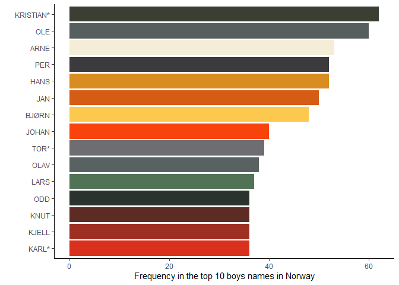

<!-- README.md is generated from README.Rmd. Please edit that file -->

# vikingR

<!-- badges: start -->

<!-- badges: end -->

vikingR creates a Viking era ggplot palette. Inspired by this
[publication](https://tinyurl.com/bdfjhv25).

## Installation

You can install the development version of vikingR from
[GitHub](https://github.com/) with:

``` r
# install.packages("devtools")
devtools::install_github("DrMattG/vikingR")
```

## Example

This is the basic usage:

``` r
library(vikingR)
library(tidyverse, quietly = TRUE)
data("topNorName1880to2020")
topNorName1880to2020%>% 
  ggplot(aes(reorder(name,n),n, fill=name)) +
  geom_histogram(stat="identity") +
  scale_fill_viking(palette = "Alle", guide = "none")+
  labs(x="", y= "Frequency in the top 10 boys names in Norway")+
  coord_flip()+
  theme_classic()
```


